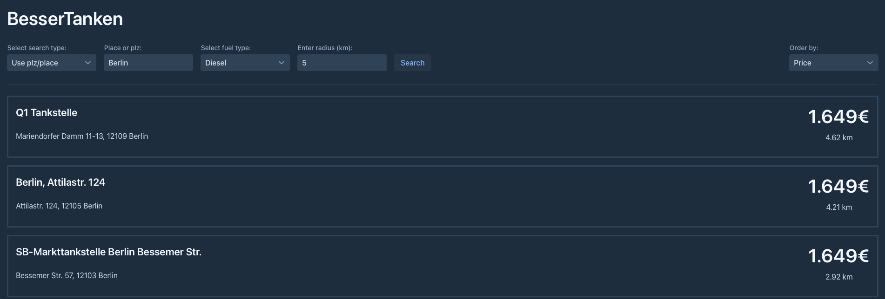

# BesserTanken

## Get the cheapest gas prices in your area.

This app uses the data from the Api [Kraftstoffbilliger](https://kraftstoffbilliger.de/mts-k_api) to get the cheapest gas prices.
To convert the plz and places to coordinates the app uses the [OpenDataSoft-Api](https://public.opendatasoft.com/explore/dataset/georef-germany-postleitzahl/table/).

## How to use

### Precondition:

1. You need to be able to run java code.
2. You need to have a working internet connection.
3. You need an active Api-Key from [Kraftstoffbilliger](https://kraftstoffbilliger.de/mts-k_api)

### Steps:
1. Clone the repository.
2. Open the project in your favorite IDE.
3. In the `Constants` class, replace the placeholder with your Kraftstoffbilliger Api-Key.
4. Start the application using the `main method` in the `Main` class.
5. By default, a browser window will open. If not, open your browser and navigate to `http://localhost:8080/`.