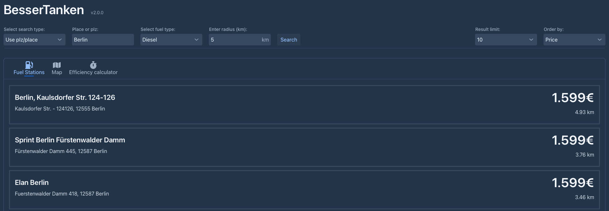

# BesserTanken

### > Available at: <a href="http://bessertanken.flix29.de" target="_blank">bessertanken.flix29.de</a>

## Get the cheapest gas prices in your area.

This app uses the data from the [Kraftstoffbilliger-Api](https://kraftstoffbilliger.de/mts-k_api) to get the cheapest 
gas prices. To convert the german postal code and places to coordinates the app uses the 
[OpenDataSoft-Api](https://public.opendatasoft.com/explore/dataset/georef-germany-postleitzahl/table/).



## How to start the application locally:

### Precondition:
1. You need to be able to run java code on your device.
2. You need to have a working internet connection.
3. You need an active Api-Key from [Kraftstoffbilliger](https://kraftstoffbilliger.de/mts-k_api).

### Steps:
1. Clone the repository.
2. Open the project in your favorite IDE.
3. In the `application.properties` file enter your Api-Key:
   - Either replace the value `your-api-key` with your own key
   - Or create a new file in the `resources` directory and name it `secret.properties`. In this file, 
   add the following line: `api.key=your-api-key`.
4. Start the application using the `main method` in the `Main` class or by running ```mvn``` in the command line.
5. By default, a browser window will open. If not, open your browser and navigate to `localhost:8080`.
